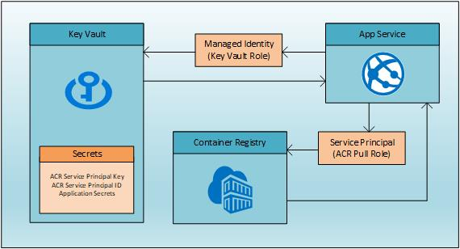

---
services:
- app-service
- key-vault
- azure-app-service
- azure-key-vault
platforms:
- linux
languages:
- node.js
- typescript
products:
- azure
- restify
- azure-app-service
- azure-key-vault
author: aflinchb
description: "A sample Node.JS REST WebAPI for bootstrapping your next App Service app using Managed Identity and Key Vault"
urlFragment: app-service-managed-identity-key-vault-nodejs-typescript
page_type: sample
---

# Build a Node.JS application using App Service, Managed Identity and Key Vault

This sample is a Node.JS REST WebAPI application designed to "fork and code" with the following features:

* Securely build, deploy and run an App Service (Web App for Containers) application
* Use Managed Identity to securely access resources
* Securely store secrets in Key Vault
* Securely build and deploy the Docker container from Container Registry or Azure DevOps



## Prerequisites

* Azure subscription with permissions to create:
  * Resource Groups, Service Principals, Keyvault, App Service, Azure Container Registry, Azure Monitor
* Bash shell (tested on Mac, Ubuntu, Windows with WSL2)
  * Will not work in Cloud Shell unless you have a remote dockerd
* Azure CLI 2.0.72+ ([download](https://docs.microsoft.com/en-us/cli/azure/install-azure-cli?view=azure-cli-latest))
* Docker CLI ([download](https://docs.docker.com/install/))
* Node.js 12.14.1+ ([download](https://nodejs.org/en/download/))
* npm 6.14.4+ (comes with Node.js)
* JQ ([download](https://stedolan.github.io/jq/download/))
* Visual Studio Code (optional) ([download](https://code.visualstudio.com/download))

## Package Status

### Dependency Vulnerability

Currently, helium-typescript has a dependency on inversify-restify-utils which has a [vulnerability](https://www.npmjs.com/advisories/1171) (Regular Expression Denial of Service) due to a dependency on an older version of restify. This is being tracked in the appropriate github repo with [this issue](https://github.com/inversify/InversifyJS/issues/1158).

## Setup

* Fork this repo and clone to your local machine
  * cd to the base directory of the repo

Login to Azure and select subscription

```bash

az login

# show your Azure accounts
az account list -o table

# select the Azure account
az account set -s {subscription name or Id}

```

Choose a unique DNS name

```bash

# this will be the prefix for all resources
# do not include punctuation - only use a-z and 0-9
# must be at least 5 characters long
# must start with a-z (only lowercase)
export mikv_Name="youruniquename"

### if nslookup doesn't fail to resolve, change mikv_Name
nslookup ${mikv_Name}.azurewebsites.net
nslookup ${mikv_Name}.vault.azure.net
nslookup ${mikv_Name}.azurecr.io

```

Create Resource Groups

* When experimenting with this sample, you should create new resource groups to avoid accidentally deleting resources
  * If you use an existing resource group, please make sure to apply resource locks to avoid accidentally deleting resources
  
* You will create 2 resource groups
  * One for ACR
  * One for App Service and Key Vault

```bash

# set location
export mikv_Location=centralus

# resource group names
export mikv_ACR_RG=${mikv_Name}-rg-acr
export mikv_App_RG=${mikv_Name}-rg-app

# create the resource groups
az group create -n $mikv_App_RG -l $mikv_Location
az group create -n $mikv_ACR_RG -l $mikv_Location

```

Save your environment variables for ease of reuse and picking up where you left off

```bash

# run the saveenv.sh script at any time to save mikv_* variables to ~/${mikv_Name}.env
# make sure you are in the root of the repo
./saveenv.sh

# at any point if your terminal environment gets cleared, you can source the file
# you only need to remember the name of the env file (or set the $mikv_Name variable again)
source ~/{yoursameuniquename}.env

```

Create Azure Key Vault

* All secrets are stored in Azure Key Vault for security
  * This sample uses Managed Identity to access Key Vault

```bash

## Create the Key Vault and add secrets
az keyvault create -g $mikv_App_RG -n $mikv_Name

# add a secret
az keyvault secret set -o table --vault-name $mikv_Name --name "MySecret" --value "Hello from Key Vault and Managed Identity!"

```

(Optional) In order to run the application locally, each developer will need access to the Key Vault. Since you created the Key Vault during setup, you will automatically have permission, so this step is only required for additional developers.

Use the following command to grant permissions to each developer that will need access.

```bash

# get the object id for each developer (optional)
export dev_Object_Id=$(az ad user show --id {developer email address} --query objectId -o tsv)

# grant Key Vault access to each developer (optional)
az keyvault set-policy -n $mikv_Name --secret-permissions get list --key-permissions get list --object-id $dev_Object_Id

```

Build and run the application locally

```bash

# install modules in package.json file
# note: you may see output like the following, this is expected and safe to ignore
# npm WARN gulp-debug@4.0.0 requires a peer of gulp@>=4 but none is installed. You must install peer dependencies yourself.
npm install

# build the app
npm run build

# run in the background
npm start -- -k $mikv_Name -a CLI &

# the application takes about 10 seconds to start
# wait for the web server started message
curl http://localhost:4120/api/secret

```

(Alternative) Run the application as a local container

```bash

# make sure you are in the root of the repo
# docker-dev builds an alpine image with Azure CLI installed in the container
# note: you may see output like the following, this is expected and safe to ignore
# npm WARN gulp-debug@4.0.0 requires a peer of gulp@>=4 but none is installed. You must install peer dependencies yourself.
docker build -t helium-dev -f Dockerfile-Dev .

# run the container
# mount your ~/.azure directory to container root/.azure directory
# $mikv_Name is set to the name of your key vault

# option using command line args
docker run -d -p 4120:4120 --name mikv-dev -v ~/.azure:/root/.azure mikv-dev "npm" "start" "--"  "--keyvault-name" "${mikv_Name}" "--auth-type" "CLI"

# option using environment variables
docker run -d -p 4120:4120 -e KEYVAULT_NAME=$mikv_Name -e AUTH_TYPE=CLI --name helium-dev -v ~/.azure:/root/.azure mikv-dev "npm" "start"

# check the logs
# re-run until the application started message appears
docker logs mikv-dev

```

Run the integration test

```bash

# WebAPI endpoint
# should return 200 - Hello from Key Vault and Managed Identity!
curl localhost:4120/api/secret

# Swagger endpoints
# should return Swagger UI HTML
curl -L localhost:4120/

# should return json object describing API
curl localhost:4120/swagger/mikv/swagger.json

```

Stop the app

```bash

fg

# press ctl-c

```

(Alternative) Stop and remove the container

```bash

docker stop mikv-dev

docker rm mikv-dev

```

Setup Container Registry

* Create the Container Registry with admin access *disabled*

```bash

# create the ACR
az acr create --sku Standard --admin-enabled false -g $mikv_ACR_RG -n $mikv_Name

# Login to ACR
# If you get an error that the login server isn't available, it's a DNS issue that will resolve in a minute or two, just retry
az acr login -n $mikv_Name

# Build the container with az acr build
### Make sure you are in the root folder of the repo

az acr build -r $mikv_Name -t $mikv_Name.azurecr.io/mikv-typescript .

```

Create a Service Principal for Container Registry

* App Service will use this Service Principal to access Container Registry

```bash

# create a Service Principal
export mikv_SP_PWD=$(az ad sp create-for-rbac -n http://${mikv_Name}-acr-sp --query password -o tsv)
export mikv_SP_ID=$(az ad sp show --id http://${mikv_Name}-acr-sp --query appId -o tsv)

# get the Container Registry Id
export mikv_ACR_Id=$(az acr show -n $mikv_Name -g $mikv_ACR_RG --query "id" -o tsv)

# assign acrpull access to Service Principal
az role assignment create --assignee $mikv_SP_ID --scope $mikv_ACR_Id --role acrpull

# add credentials to Key Vault
az keyvault secret set -o table --vault-name $mikv_Name --name "AcrUserId" --value $mikv_SP_ID
az keyvault secret set -o table --vault-name $mikv_Name --name "AcrPassword" --value $mikv_SP_PWD

```

Create and configure App Service (Web App for Containers)

* App Service will fail to start until configured properly

```bash

# create App Service plan
az appservice plan create --sku B1 --is-linux -g $mikv_App_RG -n ${mikv_Name}-plan

# create Web App for Containers
az webapp create --deployment-container-image-name hello-world -g $mikv_App_RG -n $mikv_Name -p ${mikv_Name}-plan

# assign Managed Identity
export mikv_MSI_ID=$(az webapp identity assign -g $mikv_App_RG -n $mikv_Name --query principalId -o tsv) && echo $mikv_MSI_ID

# grant Key Vault access to Managed Identity
az keyvault set-policy -n $mikv_Name --secret-permissions get list --key-permissions get list --object-id $mikv_MSI_ID

### Configure Web App

# turn on CI
az webapp config appsettings set --settings DOCKER_ENABLE_CI=true -g $mikv_App_RG -n $mikv_Name

# set the Key Vault name app setting (environment variable)
az webapp config appsettings set --settings KEYVAULT_NAME=$mikv_Name -g $mikv_App_RG -n $mikv_Name

# turn on container logging
# this will send stdout and stderr to the logs
az webapp log config --docker-container-logging filesystem -g $mikv_App_RG -n $mikv_Name

# get the Service Principal Id and Key from Key Vault
export mikv_AcrUserId=$(az keyvault secret show --vault-name $mikv_Name --name "AcrUserId" --query id -o tsv)
export mikv_AcrPassword=$(az keyvault secret show --vault-name $mikv_Name --name "AcrPassword" --query id -o tsv)

# save your mikv_* environment variables for reuse
# make sure you are in the root of the repo
./saveenv.sh

# configure the Web App to use Container Registry
# get Service Principal Id and Key from Key Vault
az webapp config container set -n $mikv_Name -g $mikv_App_RG \
-i ${mikv_Name}.azurecr.io/mikv-typescript \
-r https://${mikv_Name}.azurecr.io \
-u "@Microsoft.KeyVault(SecretUri=${mikv_AcrUserId})" \
-p "@Microsoft.KeyVault(SecretUri=${mikv_AcrPassword})"

# restart the Web App
az webapp restart -g $mikv_App_RG -n $mikv_Name

# curl the health check endpoint
# this will eventually work, but may take a minute or two
# you may get a 403 error, if so, just run again

curl https://${mikv_Name}.azurewebsites.net/api/secret

```

Run the integration test

```bash

# WebAPI endpoint
# should return 200 - Hello from Key Vault and Managed Identity!
curl https://${mikv_Name}.azurewebsites.net/api/secret

# Swagger endpoints
# should return Swagger UI HTML
curl -L https://${mikv_Name}.azurewebsites.net/

# should return json object describing API
curl https://${mikv_Name}.azurewebsites.net/swagger/mikv/swagger.json

```

## Contributing

This project welcomes contributions and suggestions.  Most contributions require you to agree to a
Contributor License Agreement (CLA) declaring that you have the right to, and actually do, grant us
the rights to use your contribution. For details, visit [Microsoft Contributor License Agreement](https://cla.opensource.microsoft.com).

When you submit a pull request, a CLA bot will automatically determine whether you need to provide
a CLA and decorate the PR appropriately (e.g., status check, comment). Simply follow the instructions
provided by the bot. You will only need to do this once across all repos using our CLA.

This project has adopted the [Microsoft Open Source Code of Conduct](https://opensource.microsoft.com/codeofconduct/).
For more information see the [Code of Conduct FAQ](https://opensource.microsoft.com/codeofconduct/faq/) or
contact [opencode@microsoft.com](mailto:opencode@microsoft.com) with any additional questions or comments.
